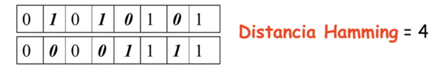

# Distancia de Hamming
---------------------------------------------

La distancia de Hamming es una pieza clave en la teoría de la información. Esta busca medir en cuántas componentes difieren dos palabras de la misma longitud. Lo que se traduce en el siguiente ejemplo:



Construya una función en Python que reciba dos objetos iterables y retorne la distancia de Hamming entre ambas. En caso de que los objetos ingresados no coincidan en longitud debe retornar *False*.


## Ejemplos

### Ejemplo 1

Llamada:
```
hamming("100101001","100011001")
```
Retorno:
```
2
```


### Ejemplo 2

Llamada:
```
hamming("Hola mundo","Holi mondu")
```

Retorno:
```
3
```
